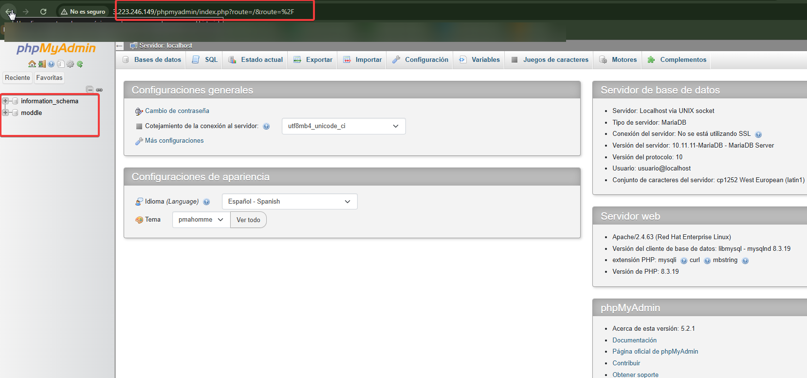
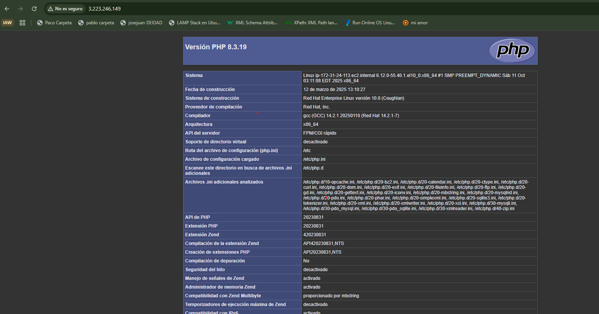

# Practica_2_IAW
Practica_2_IAW RED HAT BUSCARSE LA VIDA
Para esta practica sera igual a la practica-1 salvo que cambiamos de debian a Red-Hat
Para  poder "Cambiar" hay que rralizar cambios en los .sh para que red hat lo interprete bien-ç.

# ---------------------------
# CAMBIOS REALIZADOS AL ADAPTAR EL SCRIPT DE DEBIAN/UBUNTU A RED HAT (RHEL)
# ---------------------------
```bash

1 GESTOR DE PAQUETES
 En Debian/Ubuntu se usa "apt", mientras que en Red Hat se usa "dnf".
 Ejemplo:
   Debian → apt install apache2 -y
   RHEL   → dnf install httpd -y
```
```bash
2. SERVICIO DE APACHE
 En Debian el servicio se llama "apache2" y en Red Hat se llama "httpd".
Los archivos de configuración también cambian de ubicación:
   Debian: /etc/apache2/sites-available/
   RHEL:   /etc/httpd/conf.d/
 En RHEL no se usan los comandos "a2enmod" o "a2ensite", porque
 cualquier archivo .conf dentro de conf.d se carga automáticamente.
```
```bash
 3. RUTAS DE LOGS
 En Debian los logs están en /var/log/apache2/
 En RHEL los logs están en /var/log/httpd/
 Se cambiaron las líneas correspondientes:
   ErrorLog /var/log/httpd/error.log
   CustomLog /var/log/httpd/access_log combined
```
```bash
 4. USUARIOS Y PERMISOS
 En Debian el usuario del servicio web es "www-data".
 En RHEL el usuario del servicio web es "apache".
 Por eso se cambió:
   chown -R apache:apache /var/www/html/
```
```bash
 5. PHP Y MYSQL / MARIADB
 Los paquetes de PHP cambian de nombre:
   Debian: apt install php libapache2-mod-php php-mysql
   RHEL:   dnf install php php-mysqlnd
 Además, RHEL usa "mariadb-server" en lugar de "mysql-server",
 pero los comandos de uso (mysql -u root, etc.) son los mismos.
 pero los comandos de uso (mysql -u root, etc.) son los mismos.
```
```bash
 6. PHPMYADMIN
 En Debian se instala directamente con "apt install phpmyadmin".
 En RHEL no está en los repos oficiales, así que se descarga manualmente
 desde la página oficial de phpMyAdmin y se descomprime en /usr/share/phpmyadmin.
 Luego se crea un archivo de configuración en /etc/httpd/conf.d/phpmyadmin.conf.
 pero los comandos de uso (mysql -u root, etc.) son los mismos.
```
```bash
 7. CONFIGURACIÓN DE VIRTUALHOST
 El archivo 000-default.conf se adaptó cambiando solo las rutas de log
 y agregando "Require all granted" para que Apache 2.4 en RHEL
 permita el acceso a las carpetas del sitio.
   Debian: ${APACHE_LOG_DIR}/error.log
   RHEL:   /var/log/httpd/error.log
 pero los comandos de uso (mysql -u root, etc.) son los mismos.
```
```bash
 8. GOACCESS Y RUTAS
 La ruta de los logs para GoAccess cambió de:
   /var/log/apache2/access.log → /var/log/httpd/access_log
 También se corrigió "$home" por "$HOME", que es la forma correcta en bash.
 pero los comandos de uso (mysql -u root, etc.) son los mismos.
```
```bash
# ---------------------------
# RESUMEN
# Los cambios son principalmente de rutas, nombres y comandos de sistema.
# MariaDB, phpMyAdmin, Adminer y GoAccess, pero adaptado para Red Hat.
# ---------------------------
```



